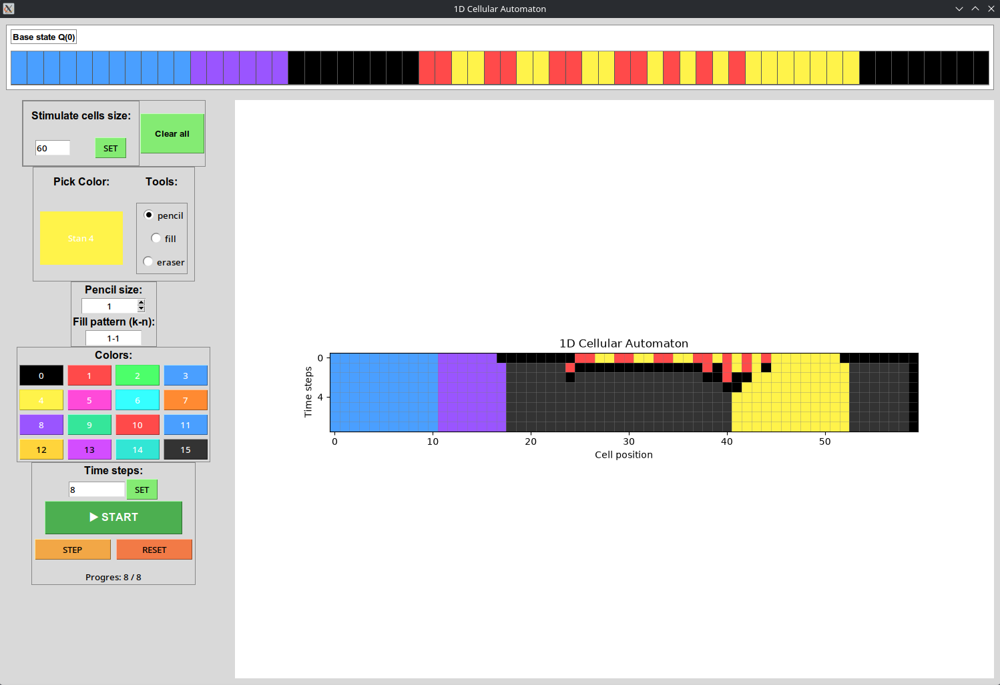
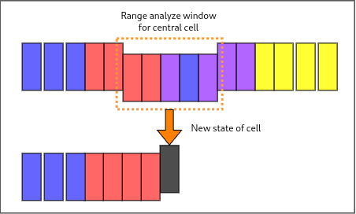

# GUI SIMULATION 1D CELLULAR AUTOMATA



A desktop application built with **Python**, **Tkinter**, and **Matplotlib** designed for interactive simulation, visualization, and dynamic experimentation with **1D Cellular Automata**.

---

## 🏗️ Architecture & Classes

The application is split into modular components to maintain clean code separation:

*   **`Pallet` (`src/ui/Pallet.py`):** 
    Manages the initial state configuration $Q(0)$ of the cellular automaton on an interactive canvas. It implements core drawing tools including a pencil (with adjustable brush size), an eraser, and a custom $k-n$ pattern fill mechanism.
*   **`OperatorPanel` (`src/ui/OperatorPanel.py`):** 
    Provides the control sidebar containing text inputs for width and steps, a dynamic color palette, and simulation execution buttons. It captures user inputs and directly coordinates state updates with the main application controller.
*   **`SymulationPlot` (`src/ui/SymulationPlot.py`):** 
    Handles the computational engine and the Matplotlib-based time-step space-time diagram. It maintains the simulation buffer history and drives the generation loop forward.

---

## ⚙️ Custom Rules & Hot-Reloading (`rule.py`)

The application supports a flexible and dynamic rule modification workflow without requiring restarts.

*   **Location:** The rule logic is cleanly isolated in `src/core/rule.py`.
*   **Automaton Logic:** The current rule evaluates a neighborhood of radius $R=2$ (checking adjacent cells and their states). It applies threshold conditions based on cell frequencies, boundary states, and neighborhood patterns to determine the next state of each cell.



* **Live Reload Mechanism:** During each simulation step (`next_generation`), the program automatically invokes `importlib.reload()` on the rule module. This means you can edit `rule.py` in your code editor while the application runs, hit save, and the simulation will instantly execute your new logic on the next run.

```python

def rule(cells: list[int], index: int) -> int:
 
    ## Information for last state whit is stable empty cell (cannot be relive again)
    highest_state = Config.Cell.ACTIVE_STATE - 1
    
    radius = 2

     resized_cells = (
            [cells[0]] * radius
            + cells
            + [cells[-1]] * radius
    )
    index = index + radius

    neighbors = resized_cells[
        index - radius: index + radius + 1
    ]
    cl2 = resized_cells[index - 2]
    cl1 = resized_cells[index - 1]
    cc = resized_cells[index]
    cr1 = resized_cells[index + 1]
    cr2 = resized_cells[index + 2]

    ret_cc = None
    if cc > 0:

        if neighbors.count(cc) >= 3:
            ret_cc = cc
        elif cc == highest_state:
            if neighbors.count(cc) + neighbors.count(0) >= 3:
                ret_cc = cc
            else:
                ret_cc = 0
        else:
            ret_cc = 0
   else:
        if neighbors.count(0) + neighbors.count(highest_state) >= 4:
            ret_cc = highest_state
        else:
            if cr2 == cr1 and (cr1 != 0):
                ret_cc = cr1
            elif cl2 == cl1 and (cl1 != 0):
                ret_cc = cl1
            else:
                ret_cc = 0
   return ret_cc

```